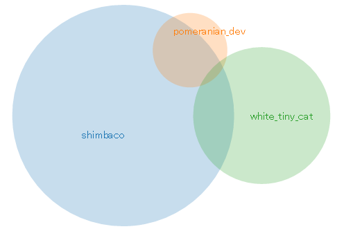

# annict-watched-venn

annict-watched-venn is a tool to represent watched animation history with Venn diagram from referring Annict's user information.



## Installation

Recommend nodejs over `6.9.4`.

```
$ npm install
```

## Usage

1. Replace target userids in `config/user.json` you want to compare.

  ```
  [
    "shimbaco",
    "pomeranian_dev",
    "white_tiny_cat"
  ]
  ```

  NOTICE: Venn diagram supports only 1-3 users.

2. Fetch watched history and create venn.json.

  ```
  $ npm start
  ```
  
3. Launch your favorite server under 'static' diretory.

  ```
  $ python -m SimpleHTTPServer
  ```

4. Open your browser and access there.

## Note

You can represent demo Venn diagram above Proc.3-4.

